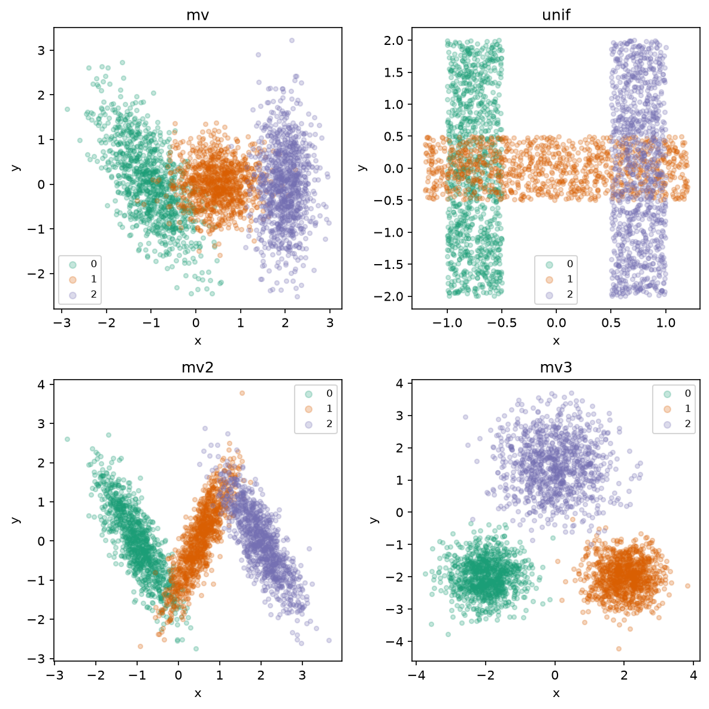
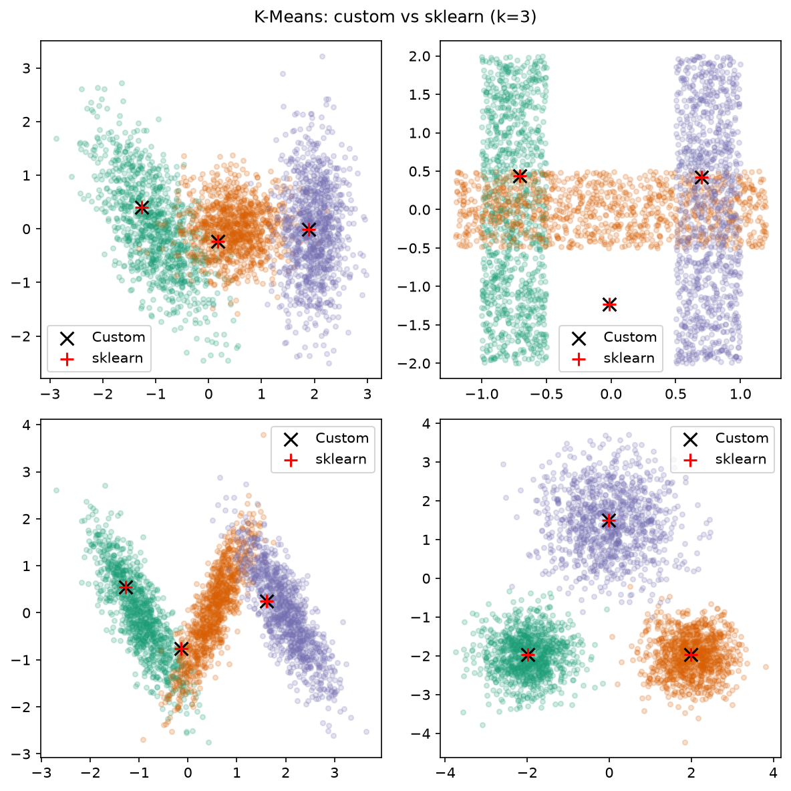
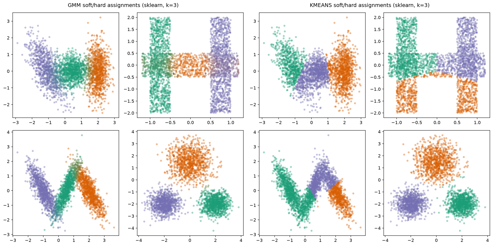

# K-Means & GMM Clustering from Scratch

**Learn clustering by building it** — then prove your implementation against scikit-learn on labeled synthetic data.

This repository is a clean, educational Python project that re-implements:

- **K-Means++** initialization
- **Hard K-Means** and **Soft (fuzzy) K-Means**
- **Gaussian Mixture Models** with Expectation-Maximization
- **DBSCAN** (density-based, with noise)
- **Agglomerative hierarchical clustering** (Ward / average / complete / single)

…and benchmarks them against scikit-learn using Adjusted Rand Index, silhouette, inertia, AIC, and BIC.

<p align="center">
  
</p>

## Why this project stands out

Most clustering tutorials stop at calling `fit()`. This one goes further:

1. **Algorithms you can read** — vectorized NumPy implementations with clear math in [`docs/algorithms.md`](docs/algorithms.md).
2. **Fair sklearn comparisons** — same initializations where it matters; side-by-side centers and labels.
3. **The right model for the geometry** — spherical blobs favor K-Means; elongated / correlated clusters need GMMs. The included datasets make that trade-off obvious.
4. **Model selection tools** — elbow / silhouette curves for K-Means and AIC/BIC for GMMs.
5. **Tests + CI** — `pytest`, `ruff`, and `mypy` on every pull request.

## Results at a glance

| Dataset | Geometry | Custom K-Means ARI | Custom GMM ARI | Takeaway |
|---------|----------|--------------------|----------------|----------|
| `mv3` | Separated spherical blobs | **0.98** | **0.99** | Both methods shine |
| `mv2` | Anisotropic, correlated | ~0.42 | **0.85** | Covariance modeling wins |
| `mv` | Mild overlap + tilt | ~0.62 | **0.84** | Soft elliptical boundaries help |
| `unif` | Overlapping uniforms | ~0.25 | ~0.57 | Hard problem; GMM still better |

Custom K-Means tracks scikit-learn inertia and labels closely when started from the same seeds.

<p align="center">
  
</p>

## Quick start

```bash
python3 -m pip install -e ".[dev]"

pytest -v
cluster-bench
```

```python
import pandas as pd
from clustering import KMeans, GaussianMixtureModel, clustering_report

df = pd.read_csv("data/mv3.csv", index_col=0)
X, y = df[["x", "y"]].to_numpy(), df["cat"].to_numpy()

km = KMeans(n_clusters=3, random_state=0).fit(X)
print(clustering_report(X, y, km.labels_, km.cluster_centers_))

gmm = GaussianMixtureModel(n_components=3, random_state=0).fit(X)
print({"bic": gmm.bic(X), "aic": gmm.aic(X)})
```

Open [`notebooks/Clustering_Methods.ipynb`](notebooks/Clustering_Methods.ipynb) for plots, soft assignments, and model-selection curves.

<p align="center">
  
</p>

## Project layout

```text
clustering/                 # Importable package + CLI
data/                       # Synthetic CSVs with ground-truth labels
notebooks/                  # Narrative walkthrough
docs/                       # Algorithms, usage, datasets
scripts/                    # Data generator + benchmark shim
tests/                      # pytest suite
assets/                     # Figure outputs
.github/workflows/ci.yml    # ruff + mypy + pytest
```

## Documentation

- [Algorithm reference](docs/algorithms.md)
- [Usage guide](docs/usage.md)
- [Datasets](docs/datasets.md)

## What improved vs. the original notebook

| Area | Improvement |
|------|-------------|
| Structure | Installable package, CLI, tests, CI, MIT license |
| K-Means++ / Soft K-Means | Correct **squared** distances + numerical stability |
| GMM | Vectorized M-step, covariance regularization, AIC/BIC |
| Extra models | DBSCAN + agglomerative hierarchical clustering |
| Evaluation | ARI, NMI, silhouette, inertia, information criteria |
| Reproducibility | `scripts/generate_data.py` documents dataset geometries |

## Requirements

Python 3.10+ · see [`pyproject.toml`](pyproject.toml).

## License

MIT © Juan David Prada Malagón — see [`LICENSE`](LICENSE).
