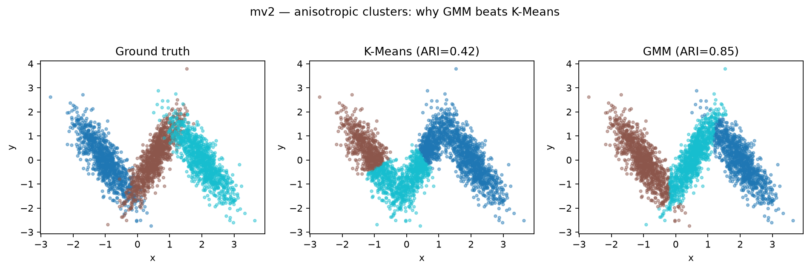

# Clustering under mismatched geometries

Case study: custom **K-Means**, **Soft K-Means**, and **Gaussian Mixture Models** (with DBSCAN and Ward as baselines) on four labeled 2-D geometries, scored against scikit-learn with ARI, silhouette, inertia, AIC, and BIC.

The question is which model recovers structure when cluster shape stops matching the algorithm’s assumptions.

## The four geometries

Same $k=3$, different failure modes. Color is ground-truth `cat`.

<p align="center">
  
</p>

**Figure — Ground truth.** Top-left `mv`: mild overlap and a tilted component. Top-right `unif`: overlapping rectangles. Bottom-left `mv2`: elongated correlated Gaussians. Bottom-right `mv3`: separated near-spherical blobs (control).

| Dataset | Geometry | What breaks |
|---------|----------|-------------|
| `mv3` | Separated spheres | Almost nothing — baselines agree |
| `mv` | Mild overlap + tilt | Hard K-Means under-segments |
| `mv2` | Anisotropic, correlated | Isotropic distance geometry fails |
| `unif` | Overlapping uniforms | Most methods struggle |

## Outcome

<p align="center">
  
</p>

**Figure — Adjusted Rand Index vs ground truth.** GMM dominates on `mv` / `mv2`; on `mv3` every method clears ~0.96. DBSCAN only fires cleanly on the separated control — density hyperparameters do not transfer across these scales.

| Dataset | K-Means | GMM | Read |
|---------|--------:|----:|------|
| `mv3` | **0.98** | **0.99** | Both recover the blobs |
| `mv2` | 0.42 | **0.85** | Covariance modeling wins |
| `mv` | 0.62 | **0.84** | Soft elliptical boundaries help |
| `unif` | 0.25 | 0.57 | Hard case; GMM still ahead |

### Where the gap is visible: `mv2`

<p align="center">
  
</p>

**Figure — `mv2` partitions.** Left: truth. Middle: K-Means cuts elliptical clouds with isotropic Voronoi cells (ARI 0.42). Right: GMM follows the covariance axes (ARI 0.85).

### Custom K-Means ≡ scikit-learn

<p align="center">
  
</p>

**Figure — Center check.** Black × = custom K-Means, red + = `sklearn.cluster.KMeans` under the same initialization. Centers coincide; remaining error vs labels is the spherical assumption, not the implementation.

### Soft GMM vs hard K-Means

<p align="center">
  
</p>

**Figure — Assignments.** Left: custom GMM colors blend near overlaps (posterior responsibilities). Right: custom K-Means hard labels. On `mv2` / `mv`, the soft elliptical model is the one that matches truth.

### Choosing $k$ on the control (`mv3`)

<p align="center">
  
</p>

**Figure — Model order.** Elbow inertia and GMM AIC/BIC both point at the true $k=3$ on the separated-spheres control.

## Formulation

Detail in [docs/formulation.md](docs/formulation.md). Core objects in the case:

**K-Means++**

$$
P(x) \propto \min_{c \in C} \lVert x - c \rVert^{2}
$$

**Soft K-Means**

$$
\phi_{i}(k) =
\frac{\exp\!\big(-\lVert x_{i}-\mu_{k}\rVert^{2} / \beta\big)}
{\sum_{j} \exp\!\big(-\lVert x_{i}-\mu_{j}\rVert^{2} / \beta\big)}
$$

**GMM**

$$
p(x) = \sum_{k=1}^{K} \pi_{k} \, \mathcal{N}(x \mid \mu_{k}, \Sigma_{k})
\qquad
\phi_{i}(k) \propto \pi_{k} \, \mathcal{N}(x_{i} \mid \mu_{k}, \Sigma_{k})
$$

## Reproduce the case

- Code: [`clustering/`](clustering/)
- Data: [`data/`](data/) — described in [docs/datasets.md](docs/datasets.md)
- Notebook: [`notebooks/Clustering_Methods.ipynb`](notebooks/Clustering_Methods.ipynb)
- Bench: `pip install -e .` then `cluster-bench`

```python
import pandas as pd
from clustering import KMeans, GaussianMixtureModel, clustering_report

df = pd.read_csv("data/mv2.csv", index_col=0)
X, y = df[["x", "y"]].to_numpy(), df["cat"].to_numpy()
km = KMeans(n_clusters=3, random_state=0).fit(X)
gmm = GaussianMixtureModel(n_components=3, random_state=0).fit(X)
print(clustering_report(X, y, km.labels_, km.cluster_centers_))
print(clustering_report(X, y, gmm.labels_, gmm.means_))
```

Juan David Prada Malagón
