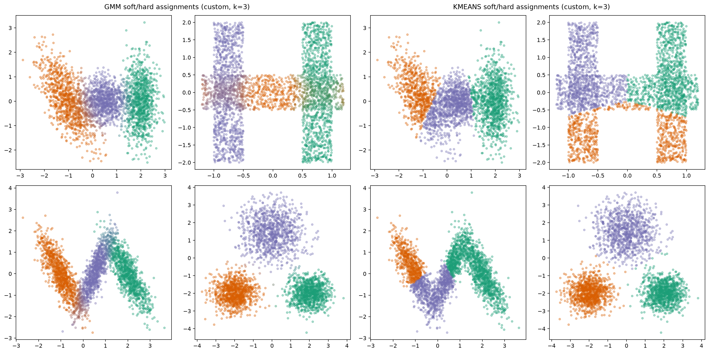
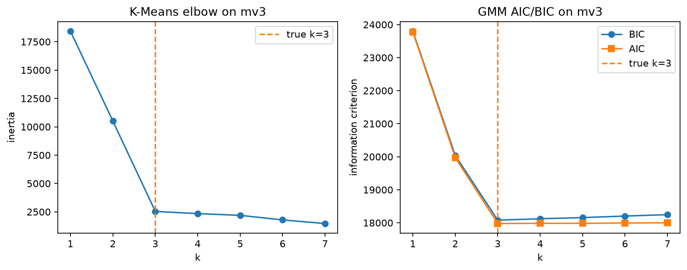
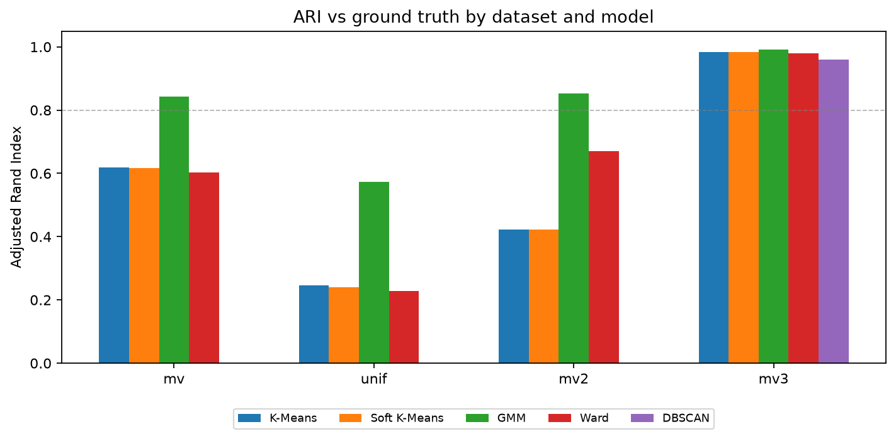

# Formulation

Objects behind the case. Implementations: `clustering/`.

## K-Means++

First center uniform on the sample; each next center $x$ is drawn with

$$
P(x) \propto \min_{c \in C} \lVert x - c \rVert^{2}
$$

until $|C| = k$.

## Hard K-Means

Assignment:

$$
c_{i} = \arg\min_{k} \lVert x_{i} - \mu_{k} \rVert^{2}
$$

Update:

$$
\mu_{k} = \frac{\sum_{i} x_{i} \, \mathbb{1}\{c_{i} = k\}}{\sum_{i} \mathbb{1}\{c_{i} = k\}}
$$

Empty clusters are re-seeded on the farthest point from the current centers. Empirically, the custom centers match scikit-learn:

  

**Figure — Implementation check.** Black × custom, red + sklearn, shared initialization. Residual label error on non-spherical data is model misspecification, not a coding gap.

## Soft K-Means

Responsibilities (temperature $\beta$):

$$
\phi_{i}(k) =
\frac{\exp\!\big(-\lVert x_{i}-\mu_{k}\rVert^{2} / \beta\big)}
{\sum_{j} \exp\!\big(-\lVert x_{i}-\mu_{j}\rVert^{2} / \beta\big)}
$$

Centroid update:

$$
\mu_{k} = \frac{\sum_{i} \phi_{i}(k)\, x_{i}}{\sum_{i} \phi_{i}(k)}
$$

## Gaussian mixture (EM)

Density:

$$
p(x) = \sum_{k=1}^{K} \pi_{k} \, \mathcal{N}(x \mid \mu_{k}, \Sigma_{k})
$$

**E-step**

$$
\phi_{i}(k) =
\frac{\pi_{k} \, \mathcal{N}(x_{i} \mid \mu_{k}, \Sigma_{k})}
{\sum_{j} \pi_{j} \, \mathcal{N}(x_{i} \mid \mu_{j}, \Sigma_{j})}
$$

**M-step** with $n_{k} = \sum_{i} \phi_{i}(k)$:

$$
\pi_{k} = \frac{n_{k}}{n}, \qquad
\mu_{k} = \frac{1}{n_{k}}\sum_{i} \phi_{i}(k)\, x_{i}
$$

$$
\Sigma_{k} =
\frac{1}{n_{k}}\sum_{i} \phi_{i}(k)\,
(x_{i}-\mu_{k})(x_{i}-\mu_{k})^{\mathsf{T}}
$$

Means start from K-Means++ (optional short hard K-Means warm start); covariances get a diagonal ridge. Soft posteriors vs hard labels in the case:

  

**Figure — Soft vs hard.** Left: GMM colors mix near overlaps ($\phi_{i}(k)$). Right: K-Means one-hot cells. The ARI lift on `mv` / `mv2` tracks this difference.

## Model order

On the spherical control, inertia and information criteria recover the true $k$:

  

**Figure — $k$ selection on `mv3`.** Left: K-Means inertia elbow. Right: GMM AIC/BIC. Dashed line marks true $k=3$.

## DBSCAN & Ward

- **DBSCAN:** core if $|N_{\varepsilon}(x)| \ge \texttt{min\_samples}$; expand by density-reachability; else noise ($-1$).
- **Ward:** agglomerative linkage, flat cut into $k$ clusters — strong on compact blobs (`mv3`).

## Scoring across the case

  

**Figure — Full scoreboard.** Metrics used elsewhere: NMI, inertia / silhouette (K-Means), AIC / BIC (GMM).
